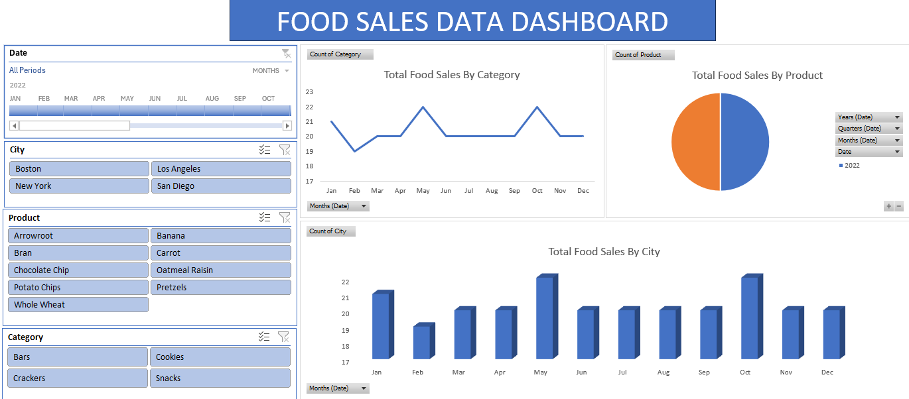
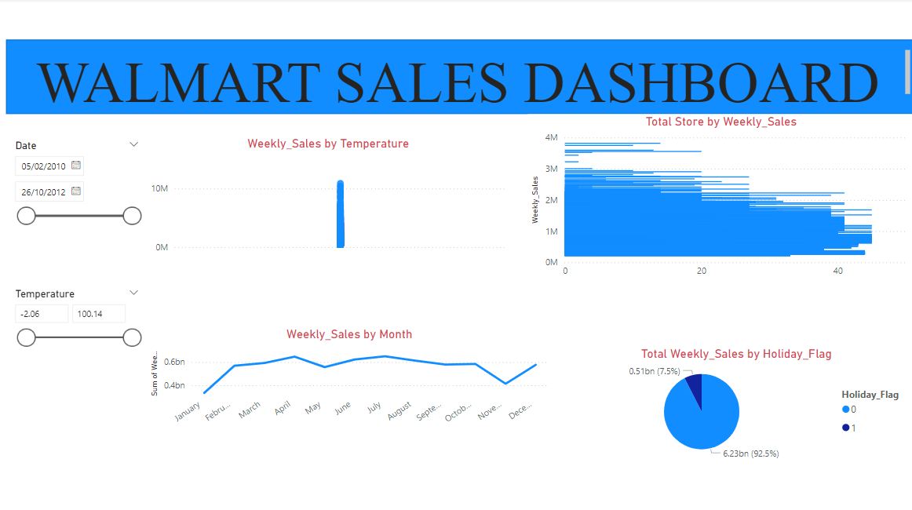

# DATA ANALYTICS PORTFOLIO
# Project 1
**Title:** [Insurance Policies Data Dashboard](https://github.com/tosinmulero/tosinmulero.github.io/blob/main/Insurance%20Policies%20Data%20Dashboard.xlsx)

**Tools Used:** Microsoft Excel(Pivot table and pivot charts, slicers, timeline controls, form controls, conditional formatting, data validation, named ranges, dynamic formulas(index, match, offset, indirect, if, vlookup and xlookup), Macros(VBA), Power query, power pivot, charts and graphs,bar charts, line charts, pie chart etc)
 
**Project Description:** This Project was carried out to analyze the insurance policies data for policy holders accross different locatons/regions.
 
**Key findings:** The dashboard appear  summary  provides counts of policy expiries by month for different categories (State, Location, and Region).

**Dashboard Overview:**

# Project 2
**Title:** [Food Sales Data Dashboard](https://github.com/tosinmulero/tosinmulero.github.io/blob/main/Food%20Sales%20Data%20Dashboard.xlsx)

**Tools Used:**Microsoft Excel(Pivot table and pivot charts, slicers, timeline controls, form controls, conditional formatting, data validation, named ranges, dynamic formulas(index, match, offset, indirect, if, vlookup and xlookup), Macros(VBA), Power query, power pivot, charts and graphs,bar charts, line charts, pie chart etc)
 
**Project Description:** This Project was carried out to analyze the Tota Sales by Category, Product and by city in a store
 
**Key findings:** The dashboard  provides summary  Total Sales By city, Category and Product and it was discovered that may and october had the highest sales by city and also by category.

**Dashboard Overview:**

# Project 3

**Title:**[Supermarket Sales Dashboard](https://github.com/tosinmulero/tosinmulero.github.io/blob/main/SUPERMARKET%20SALES%20DASHBOARD.pbix)

**Tools Used:**PowerBI Desktop, Power Query Editor, Data Modelling, Filters and Slicers.
 
**Project Description:** This analysis was carried out to get insights about Average Rating By Product Line, Total Sales By city, Total Transacion By Payment Method, Sum of Sales By Branch and Sum of Quantity By Product Line.
  
**Key findings:**The dashboard provides detailed information on supermarket sales, including various fields such as invoice details, customer information, product line, and financial data

**Dashboard Overview:**

# Project 4
**Title:**[WALMART SALES DASHBOARD.pbix](https://github.com/tosinmulero/tosinmulero.github.io/blob/main/WALMART%20SALES%20DASHBOARD.pbix)

**Tools Used:**PowerBI Desktop, Power Query Editor, Data Modelling, Filters and Slicers.
 
**Project Description:** This analysis was carried out to get insights about weekly sales by temperature,Total store by weekly sales, weekly sales by month and weekly sales by holiday flag of walmart store
  
**Key findings:**The dashboard provides detailed information on the weekly sales by temperature, total store, month and holiday flag

**Dashboard Overview:**

# Project 5

**Title:** CAR DATA SQL CLEANSING
 
**SQL Code:** [Car Data SQL Queries](https://github.com/tosinmulero/tosinmulero.github.io/blob/main/CAR_DATA.sql)
 
**SQL Skills Used:** SELECT Statements, Aggregate Functions, GROUP BY, Data Filtering and Sorting, Subqueries
 
**Project Description:** The dashboard contains detailed information on various cars, including their specifications, year of manufacture, selling price, and other attributes. 
 
**Technology used:** SQL Server

# Project 6

**Title:** PIZZA SALES SQL QUERY
 
**SQL Code:** [PIZZA SALES](https://github.com/tosinmulero/tosinmulero.github.io/blob/main/PIZZA%20SALES.sql)
 
**SQL Skills Used:** SELECT Statements, Aggregate Functions, GROUP BY, Data Filtering and Sorting, Subqueries etc
 
**Project Description:** The dashboard contains detailed information on various pizza sales, order dates, order time and other features

**Technology used:** SQL Server
